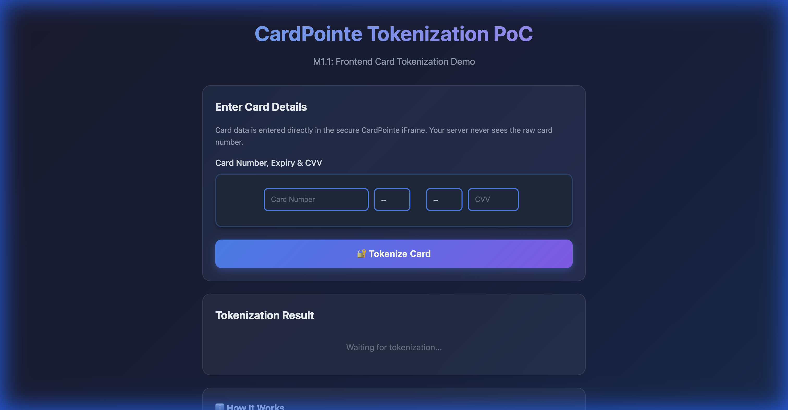
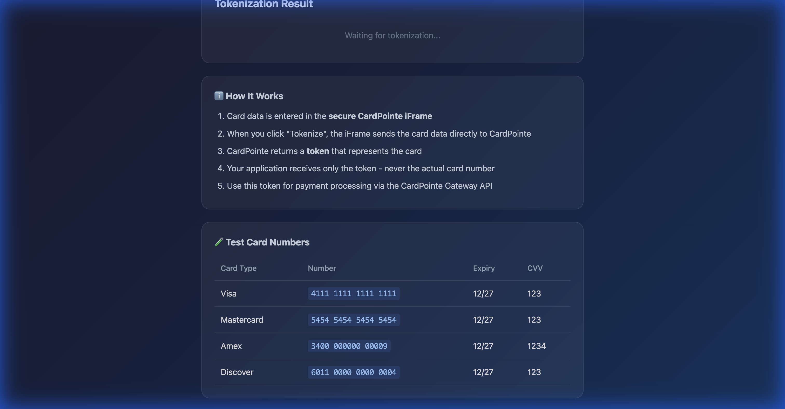
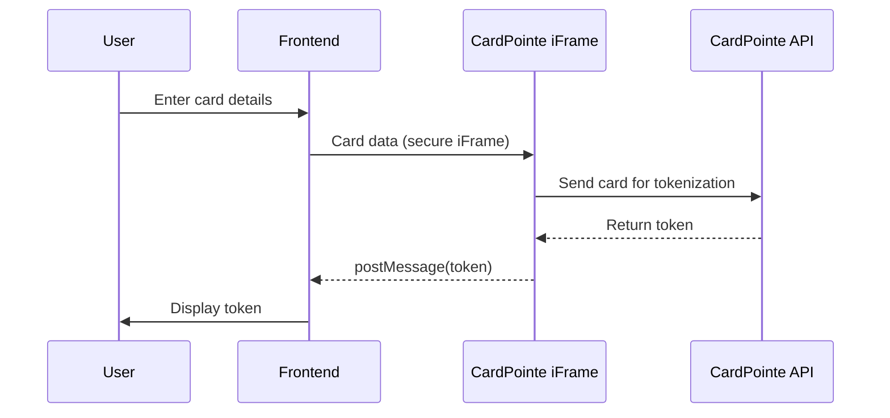
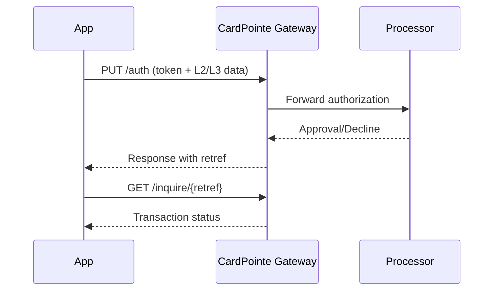

# CardPointe Tokenization PoC

A proof-of-concept demonstrating CardPointe Gateway integration with:
- **Frontend card tokenization** via secure iFrame (PCI-compliant)
- **Backend API client** with Level 2/Level 3 data support

## 🎯 Features

| Feature | Description |
|---------|-------------|
| **Secure Tokenization** | Card data never touches your server - entered directly in CardPointe's hosted iFrame |
| **L2/L3 Data Support** | Enhanced transaction data for commercial cards (purchase orders, line items, tax info) |
| **TypeScript Client** | Fully typed API client for CardPointe Gateway REST API |
| **Dark Theme UI** | Modern, production-ready frontend design |

---

## 📸 Screenshots

### Frontend - Card Entry


The secure iFrame handles card number, expiry date, and CVV entry. Raw card data never reaches your server.

### Frontend - Documentation Section


Built-in test card reference and step-by-step explanation of the tokenization flow.

### Backend - L2/L3 Transaction Demo
```
═══════════════════════════════════════════════════════════════
   CardPointe Gateway API - L2/L3 Transaction Demo
═══════════════════════════════════════════════════════════════

📋 STEP 1: Preparing L3 Line Items...

Line Items:
  - Premium Widget: 2 x $10.00 = $20.00 (tax: $1.80)
  - Deluxe Gadget: 1 x $15.00 = $15.00 (tax: $1.35)

  Subtotal: $35.00
  Tax:      $3.15
  ─────────────────
  Total:    $38.15

═══════════════════════════════════════════════════════════════
📋 STEP 2: Authorizing Payment with L2/L3 Data...
═══════════════════════════════════════════════════════════════

✅ Authorization Result:
─────────────────────────────────────────────────────────────
  Status:           ✅ APPROVED
  Response Code:    000
  Response Text:    Approval
  Auth Code:        PPS039
  Reference #:      035246114225
  Token:            9418594164541111
  Amount:           $38.15

═══════════════════════════════════════════════════════════════
📋 STEP 3: Inquiring Transaction Status...
═══════════════════════════════════════════════════════════════

📊 Transaction Status:
─────────────────────────────────────────────────────────────
  Reference #:      035246114225
  Settlement:       Queued for Capture
  Voidable:         Y
```

---

## 🚀 Quick Start

### Prerequisites
- Node.js 18+
- CardPointe UAT credentials

### Installation
```bash
git clone https://github.com/yaiechnyk-oleh/cardpointe-poc.git
cd cardpointe-poc
npm install
```

### Configuration
Copy the example environment file and add your credentials:
```bash
cp .env.example .env
```

Edit `.env` with your CardPointe credentials:
```env
CARDPOINTE_API_URL=https://fts-uat.cardconnect.com/cardconnect/rest
CARDPOINTE_USERNAME=your_username
CARDPOINTE_PASSWORD=your_password
CARDPOINTE_MERCHANT_ID=your_merchant_id
CARDPOINTE_TOKENIZER_URL=https://fts-uat.cardconnect.com/itoke/ajax-tokenizer.html
```

### Run the Demo

**Frontend (Tokenization):**
```bash
npm run serve-frontend
# Open http://localhost:3000
```

**Backend (L2/L3 Authorization):**
```bash
npm run demo
```

---

## 📁 Project Structure

```
cardpointe-poc/
├── frontend/
│   ├── index.html      # Tokenization UI with CardPointe iFrame
│   └── styles.css      # Dark theme styling
├── src/
│   ├── client.ts       # CardPointe Gateway API client
│   ├── config.ts       # Environment configuration
│   ├── demo.ts         # L2/L3 transaction demo script
│   └── types.ts        # TypeScript interfaces
├── docs/               # Screenshots for documentation
├── .env.example        # Environment template
└── package.json
```

---

## 🔌 How It Works

### Frontend Tokenization Flow



1. User enters card data in the **secure CardPointe iFrame**
2. iFrame sends data directly to CardPointe (never touches your server)
3. CardPointe returns a **token** representing the card
4. Your app uses this token for subsequent API calls

### Backend Authorization Flow



---

## 🔐 API Client Usage

### Initialize Client
```typescript
import { CardPointeClient } from './client';

const client = new CardPointeClient();
```

### Authorize with L2/L3 Data
```typescript
const response = await client.authorize({
    amount: '38.15',
    account: '9418594164541111',  // Token from frontend
    expiry: '1227',
    
    // Level 2 Data
    ponumber: 'PO-2026-00123',
    taxamnt: '3.15',
    
    // Level 3 Data
    shiptozip: '19106',
    orderdate: '20260203',
    items: [
        {
            lineno: '1',
            description: 'Premium Widget',
            quantity: '2',
            unitcost: '10.00',
            netamnt: '20.00',
            taxamnt: '1.80',
        }
    ]
});
```

### Other Operations
```typescript
// Inquire transaction status
const status = await client.inquire('035246114225');

// Capture authorized transaction
const capture = await client.capture('035246114225');

// Void transaction
const void = await client.void('035246114225');
```

---

## 🧪 Test Cards

| Card Type | Number | Expiry | CVV |
|-----------|--------|--------|-----|
| Visa | `4111 1111 1111 1111` | 12/27 | 123 |
| Mastercard | `5454 5454 5454 5454` | 12/27 | 123 |
| Amex | `3400 000000 00009` | 12/27 | 1234 |
| Discover | `6011 0000 0000 0004` | 12/27 | 123 |

---

## 🔗 Resources

- [CardPointe Gateway API Documentation](https://developer.cardpointe.com/cardpointe-gateway)
- [CardPointe Hosted iFrame Tokenizer](https://developer.cardpointe.com/hosted-iframe-tokenizer)
- [Level 2/Level 3 Data Requirements](https://developer.cardpointe.com/cardpointe-gateway#level-2-level-3-data)

---

## 📝 License

ISC
